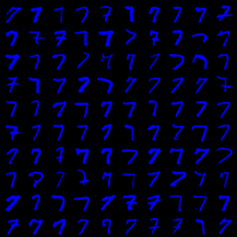
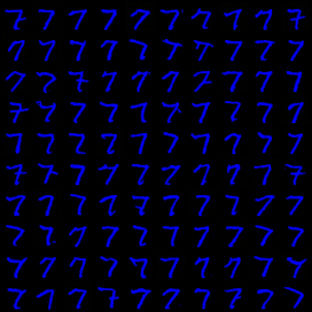
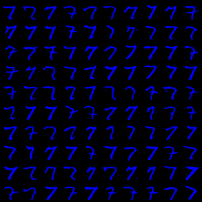
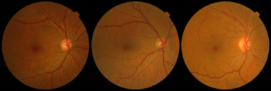
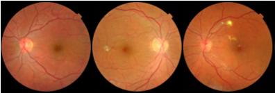

# Few-Shot Flow Matching (FSFM) for Retinal Image Adaptation

> **Anonymous Submission for MICCAI 2026**
> Code repository for the paper: *"Few-Shot Flow Matching with Barycentric Sampling for Image Synthesis"*

This repository contains the PyTorch implementation of **Few-Shot Flow Matching (FSFM)**. FSFM is a generative adaptation framework that bridges extreme data-scarce regimes in medical imaging. By leveraging a frozen, label-free pre-trained prior and Stochastic Barycentric Sampling, FSFM adapts to novel local target domains using as few as 50 anchor images.

---

## ⚙️ Environment Setup & Dependencies

Our flow matching implementation is built upon the foundational work provided in the [conditional-flow-matching](https://github.com/atong01/conditional-flow-matching) repository. Please ensure you follow their base environment guidelines if you encounter any OS-specific compilation issues.

To ensure reproducibility, we provide a `requirements.txt` mapping our working environment 

```bash
# Create and activate the conda environment
conda create -n fsfm_env python=3.10
conda activate fsfm_env

# Install dependencies from the requirements file
pip install -r requirements.txt --extra-index-url [https://download.pytorch.org/whl/cu113](https://download.pytorch.org/whl/cu113)

---

## 🔴🟢🔵 Colored MNIST

To evaluate robustness to anomalous anchors, we tested FSFM on a Coloured MNIST task.

* **Manifold Projection:** When conditioned on out-of-distribution (OOD) "Purple" digits, the model safely projected the OOD embedding onto the nearest valid region of the learned manifold without hallucinating artifacts.
* **Sampling Diversity:** Barycentric sampling captures significantly higher diversity compared to standard average sampling.

### Qualitative Results

| Real Data | Average Sampling | Barycentric Sampling |
| --- | --- | --- |
|  |  |  |
| *Diversity: 0.054* | *Diversity: 0.027* | *Diversity: 0.036* |

*Figure: Barycentric sampling successfully captures more diversity (e.g., adding/removing dashes, altering thickness) while maintaining structural integrity.*

### Quantitative Evaluation

*(GS = Guidance Scale)*

| Conditioning Strategy | Colour Acc. | Digit Acc. | Fidelity | Diversity |
| --- | --- | --- | --- | --- |
| Unconditional (Lower Bound) | 35.40% | 10.00% | 0.141 | 0.144 |
| Real Data (Upper Bound) | 100.00% | 99.02% | 0.048 | 0.047 |
| Average (GS=3, Any Label) | 100.00% | 75.96% | 0.029 | 0.019 |
| Average (GS=3, Same Label) | 100.00% | **98.38%** | 0.026 | 0.016 |
| **Barycentric (GS=3, Same Label)** | 100.00% | 96.90% | **0.029** | **0.024** |
| Average (GS=2, Same Label) | 100.00% | **97.22%** | 0.028 | 0.020 |
| **Barycentric (GS=2, Same Label)** | 100.00% | 95.60% | **0.030** | **0.027** |

### Code Execution

To train the Coloured MNIST model, execute `CM_train.py`. The dataset will download automatically.

* To generate images using barycentric sampling: `python CM_generation_barycentric.py`
* To generate images using average sampling: `python CM_generation_avg.py`
* For evaluation metrics, run `CM_test_colour.py` and `CM_LPIPS.py`.

---

## 👁️ Retina

### 1. Dataset Preparation

Before running the scripts, ensure your source and target datasets are organized in the root directory. Please download [EyePACS](https://www.kaggle.com/c/diabetic-retinopathy-detection) and [MESSIDOR-2](https://www.kaggle.com/datasets/mariaherrerot/messidor2preprocess/data), and update the paths in `Messidor_class.py` and `Eyepacs_class.py` respectively.

To save compute time, both datasets were pre-processed and scaled down to 256px offline. FSFM was trained on the train subset of EyePACS. The indices selected for the 50-shot target domain are saved in `hospital_B_file_list.csv`. The Test (600 samples), Validation (200 samples), and Oracle/hidden data (800 samples) were selected at random from the remainder of the dataset.

Please structure your data as follows:

```text
data/
  ├── eyepacs/  
  │     ├── train/
  │     └── validation/
  └── messidor2/ 
        ├── hospital_b/
        ├── validation/
        ├── hidden_classifier_data/
        └── test/

```

### 2. Generating Feature Embeddings

Extract feature embeddings from the source dataset (EyePACS) and the target dataset by executing:

```bash
python distance_generate_ALL_embeddings.py

```

*(Adjust the dataset and split parameters within the script to generate embeddings for both datasets).*

This outputs `.pt` files containing the structural features and indices required for the k-NN retrieval step. The script automatically generates embeddings using ImageNet, RETFound (pre-trained DINOv2), and MAE. We empirically found that our pre-processing method yields the best results.

The quality of the k-NN simplex heavily depends on the frozen feature extractor. Under Target Domain evaluation with Barycentric sampling, **DINOv2 (via RETFound)** consistently provided the most robust latent space.

*Detailed Target Domain Performance Breakdown (Class accuracies represent Recall):*

### Detailed Target Domain Performance Breakdown
*Comparison of representation quality on the source domain (EyePacs), synthetic target generation with and without Barycentric sampling (`hospital_b`), and linear probing on raw target embeddings (`hidden_data`). Class accuracies represent model Recall.*

| Embedding Method | Bal. Acc. ⬆ | QWK ⬆ | Class 0 | Class 1 | Class 2 | Class 3 | Class 4 |
| :--- | :---: | :---: | :---: | :---: | :---: | :---: | :---: |
| **Source Domain: EyePacs Training Data** | | | | | | | |
| ImageNet | 42.36% | 0.31 | 0.45 | **0.38** | 0.30 | **0.49** | 0.58 |
| ImageNet (Same Label) | 42.36% | 0.30 | 0.45 | **0.38** | 0.30 | **0.49** | 0.58 |
| MAE | 50.74% | 0.42 | 0.54 | 0.36 | 0.43 | 0.45 | **0.68** |
| MAE - RetFound preproc. | 48.86% | 0.40 | 0.51 | 0.35 | 0.43 | 0.40 | 0.62 |
| **DINOv2** | **55.32%** | **0.50** | **0.58** | 0.37 | **0.51** | 0.46 | 0.63 |
| DINOv2 - RetFound preproc. | 52.46% | 0.46 | 0.55 | 0.35 | 0.48 | 0.47 | 0.61 |
| **Target Domain: `hospital_b` Split (N=1050)** | | | | | | | |
| *No barycentric sampling* | | | | | | | |
| ImageNet | 31.50% | 0.1242 | 0.34 | 0.23 | 0.28 | 0.38 | **0.50** |
| ImageNet (Same label) | 31.50% | 0.1242 | 0.34 | 0.23 | 0.28 | 0.38 | **0.50** |
| RETFound (MAE) | 42.33% | 0.3041 | **0.56** | 0.31 | 0.15 | 0.31 | **0.50** |
| **RETFound (DINOv2)** | **43.33%** | **0.5052** | 0.49 | **0.37** | **0.23** | **0.72** | **0.50** |
| *With barycentric sampling* | | | | | | | |
| ImageNet | 33.83% | 0.1538 | 0.37 | 0.25 | **0.29** | 0.41 | 0.50 |
| ImageNet (Same Label) | 33.67% | 0.1488 | 0.37 | 0.25 | 0.28 | 0.41 | 0.50 |
| RETFound (MAE) | 44.50% | 0.3729 | **0.60** | 0.30 | 0.14 | 0.31 | **0.60** |
| **RETFound (DINOv2)** | **44.67%** | **0.5181** | 0.51 | **0.40** | 0.21 | **0.76** | 0.50 |
| **Target Domain: Linear Probing on `hidden_data` (N=800)** | | | | | | | |
| ImageNet | 52.00% | 0.4417 | 0.66 | 0.29 | 0.39 | 0.28 | 0.10 |
| ImageNet (Same label) | 53.50% | 0.4417 | 0.66 | 0.29 | 0.39 | 0.28 | 0.10 |
| RETFound (MAE) | 57.17% | 0.5438 | 0.72 | 0.23 | 0.48 | 0.41 | **0.50** |
| **RETFound (DINOv2)** | **63.17%** | **0.6050** | **0.79** | **0.27** | **0.54** | **0.52** | 0.30 |


*Note: Run `assess_features.py` to train a linear regression on the embeddings and generate a similar accuracy report.*

### 3. Phase 1: Label-Free Pre-Training

Train the continuous vector field entirely on unlabelled source data. The conditioning is dynamically calculated using the k-nearest neighbors in the embedding space.

```bash
# Execute training across multiple GPUs
python Eyepacs_train_multiple_gpus.py

# Alternatively, use the provided shell script for cluster submission:
bash flow_script.sh

```

### 4. Phase 2: Few-Shot Generation (Barycentric Adaptation)

Using only 50 labeled anchor images from the target domain, we generate diverse synthetic samples via Stochastic Barycentric Sampling.

<p align="center">



<i>Anchor reference compared to its nearest neighbors in the learned manifold.</i>
</p>

To find the optimal guidance scale for your specific target domain, execute:

```bash
python Eyepacs_experiment_guidance_scale.py 

```

This generates a grid of images using different guidance scales. Our empirical ablations indicate that a guidance scale of w=1 provides the optimal balance of generative diversity and structural fidelity for downstream classification.

Once optimal parameters are set, execute `Eyepacs_generation.py` to generate the final augmented dataset. Output files will be organized as follows:

* `main_folder/samples/anchor_filename/` (Contains individual generated `.png` samples)
* `main_folder/summary/anchor_filename/` (Contains the original anchor, nearest neighbors, and a grid of all generated outputs)

<p align="center">



<i>Example grid of generated synthetic target domain samples.</i>
</p>

### 5. Evaluation & Downstream Classification

Evaluate visual fidelity (FID/LPIPS) and train the ResNet classifiers on the FSFM-augmented datasets.

```bash
# Calculate FID and LPIPS
python Messidor_FID.py
python CM_LPIPS.py

```

Note on Downstream Classifiers: To maintain strict modularity between the generative pipeline and the clinical evaluation, the downstream ResNet classification framework (including data loaders, training loops, and metrics for Tables 1 & 2) is maintained in a dedicated secondary repository.

---

## 📄 Reproducibility & Open Science

This repository is submitted strictly for double-blind peer review. To ensure compliance with MICCAI anonymity guidelines, model checkpoints and specific data splits have been temporarily withheld. Upon acceptance, we will release:

* Pre-trained Phase 1 model weights.
* Full setup instructions for the downstream clinical classifiers.
* The complete secondary classification repository, including all training scripts, validation loops, and downstream evaluation code.
