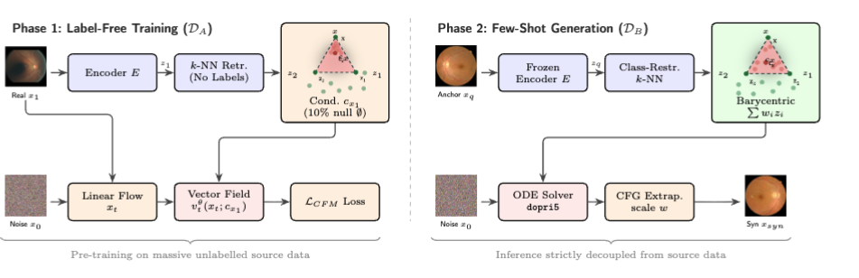

# Few-Shot Flow Matching with Stochastic Barycentric Sampling for Image Synthesis

> **Anonymous Submission for MICCAI 2026**
> Code repository for the paper: *"Few-Shot Flow Matching with Stochastic
Barycentric Sampling for Image Synthesis"*

<p align="center">



<i>Architecture diagram</i>
</p>

This repository contains the PyTorch implementation of **Few-Shot Flow Matching (FSFM)**. FSFM is a generative adaptation framework that bridges extreme data-scarce regimes in medical imaging. By leveraging a frozen, label-free pre-trained prior and Stochastic Barycentric Sampling, FSFM adapts to novel local target domains using as few as 50 anchor images.

---

## ⚙️ Environment Setup & Dependencies

Our flow matching implementation is built upon the foundational work provided in the [conditional-flow-matching](https://github.com/atong01/conditional-flow-matching) repository. Please ensure you follow their base environment guidelines if you encounter any OS-specific compilation issues.

To ensure reproducibility, we provide a `requirements.txt` mapping our working environment.

```bash
# Create and activate the conda environment
conda create -n fsfm_env python=3.10
conda activate fsfm_env

# Install dependencies from the requirements file
pip install -r requirements.txt --extra-index-url https://download.pytorch.org/whl/cu113

```

---

## 🔴🟢🔵 Colored MNIST (CM)
<!-- ### Qualitative & Quantitative Results -->

| Real Data | Average Sampling, GS=3 | Barycentric Sampling, GS=3 |
| --- | --- | --- |
|  |  |  |
| *Diversity: 0.047* | *Diversity: 0.016* | *Diversity: 0.024* |

 *Figure: Barycentric sampling successfully captures more diversity (e.g., adding/removing dashes, altering thickness) while maintaining structural integrity.*

*(GS = Guidance Scale)*

| Conditioning Strategy | Colour Acc. | Digit Acc. | Fidelity | Diversity |
| --- | --- | --- | --- | --- |
| Unconditional (Lower Bound) | 35.40% | 10.00% | 0.141 | 0.144 |
| Real Data (Upper Bound) | 100.00% | 99.02% | 0.048 | 0.047 |
| Average (GS=3, Any Label) | 100.00% | 75.96% | 0.029 | 0.019 |
| Average (GS=1, Same Label) | 100.00% | 91.88% | 0.032 | 0.032 |
| Average (GS=2, Same Label) | 100.00% | **97.22%** | 0.028 | 0.020 |
| **Barycentric (GS=2, Same Label)** | 100.00% | 95.60% | **0.030** | **0.027** |
| Average (GS=3, Same Label) | 100.00% | **98.38%** | 0.026 | 0.016 |
| **Barycentric (GS=3, Same Label)** | 100.00% | 96.90% | **0.029** | **0.024** |
| Average (GS=5, Same Label) | 100.00% | 98.94% | 0.026 | 0.012 |
| Average (GS=7, Same Label) | 100.00% | 98.86% | 0.026 | 0.011 |

---

### Code Structure & Execution

**1. Data & Utilities**

* `CM_class.py`: Defines the dataset class for Coloured MNIST.
* `CM_real.py`: Extracts images from the validation subset and saves them in the same format as generated images to serve as upper-bound comparison data.

**2. Training**
To train the Coloured MNIST model, execute the main training script. The dataset will download automatically.

* `CM_train.py` / `CM_train_multiple_gpus.py`: Main training loops.
* `CM_get_fsfm_condition.py`: Takes a batch of images, passes them through a ResNet encoder, and dynamically calculates nearest neighbors on-the-fly during training.
* `CM_generate_images.py`: Utility for visualising generations during the training phase.

**3. Generation & Sampling**

* `CM_generation_barycentric.py`: Generates images using our proposed Stochastic Barycentric Sampling.
* `CM_generation_avg.py`: Generates images using standard average sampling (baseline).
* `CM_experiment_guidance_scale.py`: Generates image grids across different guidance scales for ablation studies.

**4. Evaluation**

* `CM_test_colour.py`: Calculates colour accuracy metrics.
* `calculate_LPIPS.py`: Computes structural fidelity/diversity metrics.

---

## 👁️ Retina

### 1. Dataset Preparation

Before running the scripts, ensure your source and target datasets are organized in the root directory. Please download [EyePACS](https://www.kaggle.com/c/diabetic-retinopathy-detection) and [MESSIDOR-2](https://www.kaggle.com/datasets/mariaherrerot/messidor2preprocess/data), and update the paths within the dataset classes.

* `Eyepacs_class.py`: Defines the EyePACS dataset class.
* `Messidor_class.py`: Defines the Messidor dataset class.
* `Messidor_save_dataset.py`: Automatically splits the dataset given the path to the original dataset and target indices.
* `hospital_B_file_list.csv`: Contains the specific, pre-selected indices for our 50-shot target domain. We ensured the selected indices are representative of the dataset and contain equal splits of each disease class.

Please structure your data as follows:

```text
data/
  ├── eyepacs/  
  │     ├── train/
  │     └── validation/
  └── messidor2/ 
        ├── hospital_b/
        ├── validation/
        ├── hidden_classifier_data/
        └── test/

```

### 2. Generating Feature Embeddings

The quality of the k-NN simplex heavily depends on the frozen feature extractor. Extract feature embeddings from the source dataset (EyePACS) and the target dataset by executing:

```bash
python distance_generate_ALL_embeddings.py

```

* `distance_generate_ALL_embeddings.py`: Master script that utilizes `distance_ImageNet.py`, `distance_RetFound_DinoV2.py`, and `distance_RetFound_MAE.py` to generate embeddings. Outputs `.pt` files required for k-NN retrieval.
* `Eyepacs_class_for_distance.py`: A simplified dataloader utilized strictly for rapid embedding calculations.
* `assess_features.py`: Trains a linear classifier on the generated embeddings to assess latent space robustness.

### 3. Phase 1: Label-Free Pre-Training

Train the continuous vector field entirely on unlabelled source data.

```bash
# Execute training across multiple GPUs
python Eyepacs_train_multiple_gpus.py

# Alternatively, use the provided shell script for cluster submission:
bash flow_script.sh

```

* `Eyepacs_generate_images.py`: Visualisation utility for monitoring the vector field during pre-training.

### 4. Phase 2: Few-Shot Generation (Barycentric Adaptation)

Using only 50 labeled anchor images from the target domain, we generate diverse synthetic samples via Stochastic Barycentric Sampling.

<p align="center">


<i>Anchor reference compared to its nearest neighbors in the learned manifold.</i>
</p>

To find the optimal guidance scale (w) for your target domain, execute:

```bash
python Eyepacs_experiment_guidance_scale.py 

```

Once optimal parameters are set, generate the final augmented dataset:

```bash
python Eyepacs_generation.py

```

Output files will be organized with samples and summary grids in their respective output directories.

<p align="center">


<i>Example grid of generated synthetic target domain samples.</i>
</p>

#### Generating for Different Subsets (Dilation Status, Seed, Shot Count)

For our ablations on MESSIDOR-2, the target domain (Hospital B) can be split three ways, and the generation scripts accept flags to control which split, anchor ordering, and shot count is used.

* **`--experiment`**: which pupil-dilation subset to draw anchors from — `all` (full cohort), `dilated` (imaged with eye drops), or `nondilated`. These splits are created once via `create_messidor2_splits.py`, which writes `messidor2_splits_{all,dilated,nondilated}.json`.
* **`--seed`**: which of three independent anchor orderings to use — `seed_A`, `seed_B`, or `seed_C` — for sampling reference/anchor images within a subset.
* **`--N`**: the number of few-shot anchor images to draw (balanced across diagnosis classes G0–G4).

**Step 1 — precompute embeddings and k-NN indices for every subset/seed/N combination (one-off, before generation):**

```bash
# Embeds the full reference pool for each experiment subset (all/dilated/nondilated)
python generate_messidor_embeddings.py

# Computes same-class k-NN indices for each (experiment, seed, N) combination.
# Edit the EXPERIMENTS / SEEDS / N_VALUES lists at the top of the script to control the sweep.
python compute_reference_knn.py
```

**Step 2 — generate images for one subset/seed/N combination:**

```bash
python Eyepacs_generation.py \
    --experiment all \        # all | dilated | nondilated
    --seed seed_A \           # seed_A | seed_B | seed_C
    --N 50 \                  # number of few-shot anchor images
    --guidance_scale 1.5 \
    --k_neighbors 2
```

Results are written to `results_16_June_gen_size_ablation/{experiment}/{seed}/N{N}/GS{guidance_scale}_K{k_neighbors}/`, with per-anchor `samples/`, `summary/` grids, and a `neighbours.csv` log of which neighbours contributed to each cohort. Use `Eyepacs_generation_rebalanced.py` (identical flags) instead if you want each subset oversampled to a fixed total per class, rather than a fixed number of samples per anchor — output is written under `results_10_June_oversampling/`.

**Step 3 — batch-generate across many subsets/seeds/N values (SLURM):**

Edit the `EXPERIMENTS`, `SEEDS`, and `N_VALUES` lists at the top of `submit_generation_jobs.py`, then run:

```bash
python submit_generation_jobs.py            # submit one job per combination
python submit_generation_jobs.py --dry-run  # preview the generated job scripts first
```

### 5. Evaluation & Downstream Classification

Evaluate visual fidelity and prepare for downstream classification.

* `Messidor_FID.py`: Calculates Frechet Inception Distance.
* `calculate_LPIPS.py`: Calculates LPIPS diversity and fidelity metrics.
* `Messidor_real_data_for_comparison.py`: Formats and saves real ground-truth data for direct comparison against synthetic outputs.

**Note on Downstream Classifiers:** To maintain strict modularity between the generative pipeline and the clinical evaluation, the downstream ResNet classification framework (including data loaders, training loops, and metrics for Tables 1 & 2) is maintained in a dedicated secondary repository.

---

## 📄 Reproducibility & Open Science

This repository is submitted strictly for double-blind peer review. To ensure compliance with MICCAI anonymity guidelines, model checkpoints have been temporarily withheld. Upon acceptance, we will release:

* Pre-trained Phase 1 model weights.
* The complete secondary classification repository, including all training scripts, validation loops, and downstream evaluation code.

---